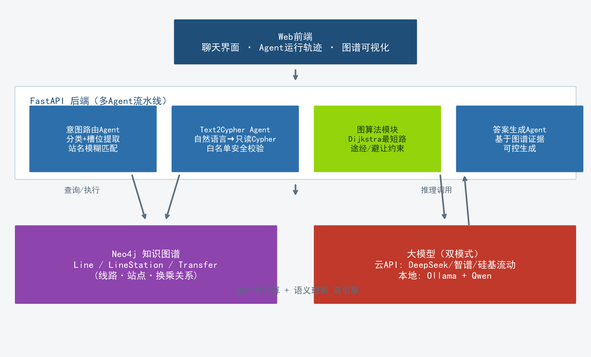
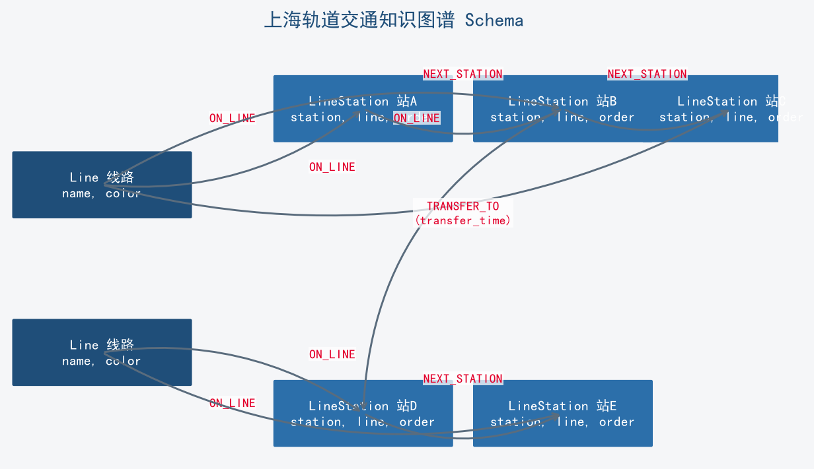
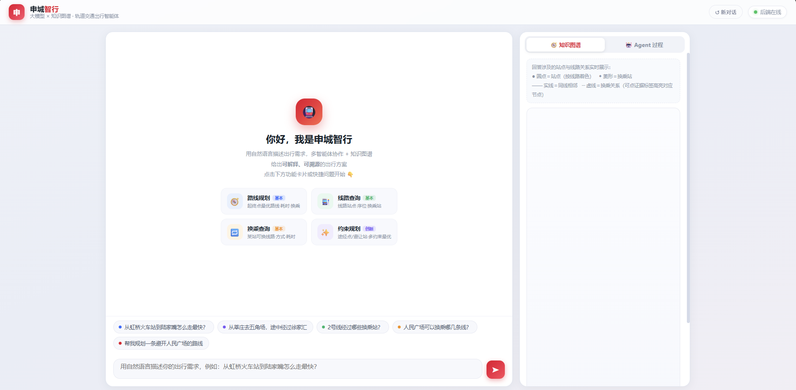
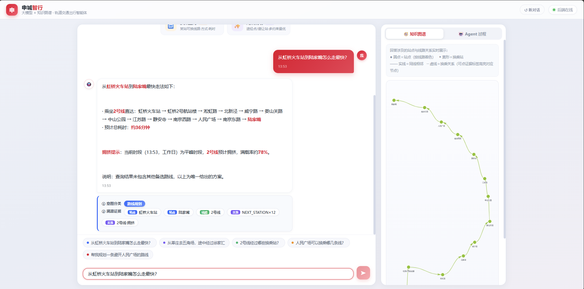
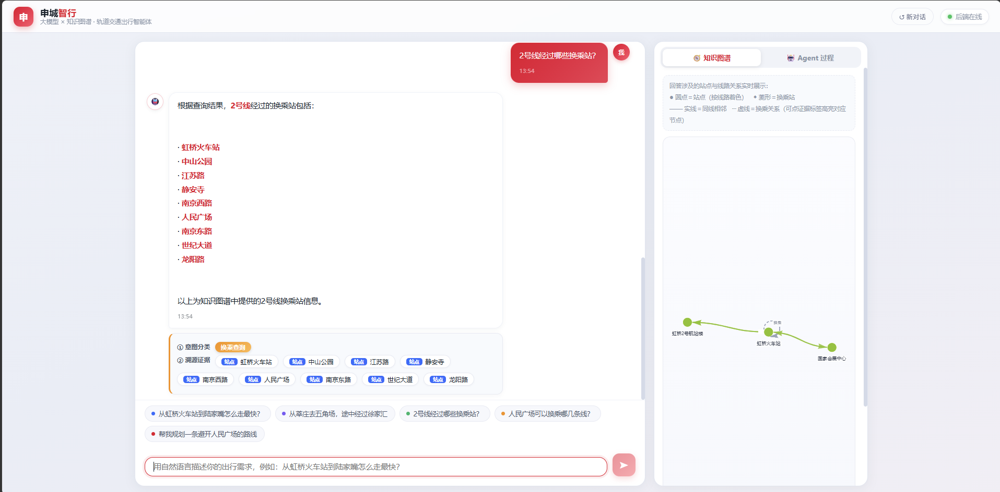
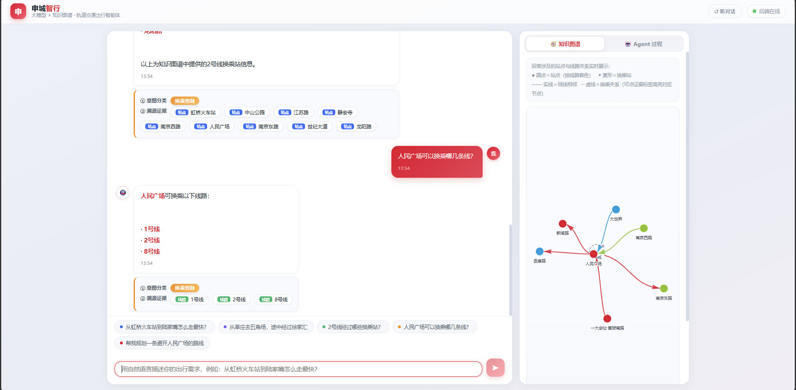
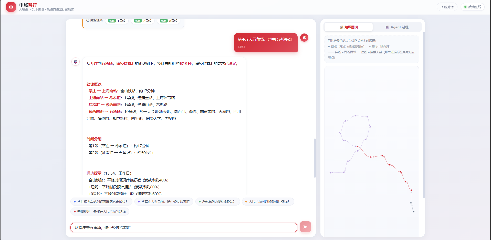

# 申城智行：大模型×知识图谱的轨道交通出行智能体

## 应用方案（初稿 · 2026-09-28）

> 参赛赛道：软件赛道（高校组）
> 团队名称：关注塔菲谢谢喵
> 队长：陈俊西（学号 23180125）、队员：朱奕祺（学号 23180126）
> 学院：人工智能学院
> 指导教师：钮佳超
> 学校：上海师范大学天华学院

---

## 摘要

随着城市轨道交通网络日益密集，乘客出行规划需求从"能到"升级为"按需到"：途经特定站点、避开拥堵换乘站、用自然语言直接提问。现有出行App以固定模板查询为主，无法理解自然语言中的复合约束，也无法回答开放性问题。大语言模型（LLM）擅长语义理解，但存在幻觉风险，直接生成出行方案可能编造不存在的线路与站点。

本项目"申城智行"提出一种大模型与知识图谱协同的多智能体出行助手：自建上海轨道交通知识图谱，以意图路由、Text2Cypher、答案生成三个智能体协作，实现自然语言驱动的路线规划（含途经点/避让站约束）与线路信息问答；路径计算由确定性图算法完成，答案由图谱数据驱动生成，每条结论均可溯源，从根本上抑制幻觉。系统后端基于FastAPI，图存储基于Neo4j，大模型支持云端API与本地Ollama双模式部署，前端提供聊天界面与Agent运行轨迹可视化，完整呈现智能体推理过程。

---

## 一、项目背景与痛点

### 1.1 行业背景

上海轨道交通运营里程超过800公里、线路20余条、日客运量超千万人次，是城市运转的主动脉。轨道交通出行服务已成为移动互联网的基础能力，也是城市数字化建设的重要一环。

### 1.2 用户痛点

1. **复合需求无法表达**：乘客出行需求日益个性化——"去五角场前先到徐家汇办点事""高峰期想避开人民广场"，现有App仅支持起终点查询，无法表达途经与避让约束。
2. **信息查询碎片化**：查询线路、换乘、首末班等信息需要在多个页面间跳转，对老年人、游客尤其不友好。
3. **自然语言问答缺失**：乘客习惯"问一句"，而非"填表单"；现有出行工具无一支持自然语言交互。
4. **传统方案的局限**：若直接用大模型生成出行方案，模型可能编造不存在的线路与站点（幻觉问题），在交通场景中后果严重。

### 1.3 技术背景

知识图谱以结构化方式刻画现实世界实体与关系，天然适合表达轨道交通网络；大模型具备强大的语义理解与生成能力。两者的结合（KG×LLM）是当前AI应用研究的热点方向：图谱提供事实约束，模型提供交互智能。

---

## 二、需求分析

### 2.1 功能需求

| 编号 | 功能 | 说明 |
|---|---|---|
| F1 | 自然语言路线规划 | 用户以自然语言描述起终点，系统返回最优路线 |
| F2 | 约束路线规划 | 支持途经点（via）与避让站（avoid）复合约束 |
| F3 | 线路/站点信息问答 | 换乘关系、线路站点等图谱信息自然语言查询 |
| F4 | 可解释回答 | 回答附证据来源（图谱节点/关系），可溯源 |
| F5 | Agent过程可视化 | 前端展示意图分类、生成查询、图谱证据的完整轨迹 |

### 2.2 非功能需求

- **安全性**：LLM生成的图查询经只读白名单校验，杜绝数据篡改与注入
- **响应速度**：单次问答端到端5秒内（云API模式）
- **可部署性**：支持云API与本地模型双模式，适配公网与内网场景

---

## 三、目标用户

- **C端乘客**（核心）：上海地铁日常乘客、游客、不熟悉App操作的中老年用户——"开口问路"即得方案
- **B端运营方**：地铁运营公司（智能客服、乘车指南）、第三方出行平台（出行方案API）

---

## 四、技术方案

### 4.1 总体架构

系统采用"前端-编排后端-双数据底座"三层架构。

{width=95%}

- **前端**：单页Web应用，聊天界面 + Agent运行轨迹面板 + 知识图谱可视化（vis-network）
- **编排后端**：FastAPI，多Agent流水线（意图路由 → 执行 → 答案生成）
- **数据底座**：Neo4j知识图谱（结构化事实）+ 大模型（语义理解与生成）；路径计算由NetworkX确定性图算法完成

### 4.2 知识图谱构建

图谱数据为团队自建，来源于公开的上海轨道交通线路信息，经清洗、去重、结构化后形成三张基础表：

- `lines.csv`（线路表）：线路编号、名称、类型、标识色、首末站
- `line_stations.csv`（线路站点表）：站线关系、站点名、序位、是否换乘站、所在区
- `transfers.csv`（换乘表）：换乘站对、换乘方式、换乘耗时
- `congestion.csv`（拥挤度表）：22条线路×5时段（早高峰/平峰/晚高峰/夜间/周末）的拥挤等级与满载率估算（基于官方公开客流资料整理）

Neo4j中的图谱Schema设计如下：

```
(:Line {name, color})                         —— 线路
(:LineStation {station, line, order})         —— 线路上站点
(:LineStation)-[:ON_LINE]->(:Line)            —— 站属于线
(:LineStation)-[:NEXT_STATION]->(:LineStation)—— 同线相邻（按序位）
(:LineStation)-[:TRANSFER_TO]->(:LineStation) —— 换乘（含耗时）
```

数据通过CSV→Cypher批量导入流程写入Neo4j，并建立唯一性约束保证数据质量。

{width=70%}

### 4.3 多智能体协作机制

系统将一次问答拆解为三个智能体协作完成：

1. **意图路由Agent**：将用户输入分类为路线规划/信息查询/闲聊三类；对路线规划请求，结构化提取起点、终点、途经点、避让站，并经模糊匹配解析为图谱规范站名（如"徐家汇站"→"徐家汇"）。
2. **Text2Cypher Agent**：对信息查询类问题，依据图谱Schema与few-shot示例生成只读Cypher查询；查询必须通过白名单安全校验（仅允许MATCH开头、禁止写操作与APOC等危险调用）方可执行。
3. **答案生成Agent**：基于图谱查询结果合成自然语言回答，要求回答严格以图谱数据为依据，不得编造。

**关键设计：AI管语义，算法管计算。** 路线规划不走LLM生成，而由确定性图算法（Dijkstra最短路 + 途经点分段拼接 + 避让站节点剔除）完成，模型只负责理解用户意图与组织答案。该设计从机制上保证了路线方案的正确性——这是本项目区别于"LLM套壳"应用的核心。

### 4.4 大模型接入

采用双模式推理架构：

- **云API模式**：OpenAI兼容协议，支持DeepSeek、智谱、硅基流动等主流服务商，公网演示即插即用
- **本地模式**：Ollama + Qwen系列开源模型，支持内网与离线场景，保护数据隐私

模型输出采用JSON结构化模式（response_format），配合稳健的JSON提取与校验兜底，保证流水线可靠性。

### 4.5 安全机制

- **Cypher只读白名单**：正则校验禁止 CREATE/DELETE/SET/MERGE/CALL/APOC 等关键字与注释注入，仅放行MATCH开头的只读查询
- **证据驱动生成**：答案生成Agent的输入仅为图谱查询结果，杜绝模型自由发挥
- **查询长度限制与异常兜底**：超长/异常查询拒绝执行并返回友好提示

### 4.6 系统实测指标

**测试保障**：43个自动化测试用例（单元+集成+API三层），覆盖路径规划算法、Cypher安全校验、站名/线路名模糊解析、拥挤度时段映射、前端响应契约等关键路径，全部通过。

**数据规模**（团队自建）：

| 数据 | 规模 |
|---|---|
| 知识图谱：线路节点 | 22条 |
| 知识图谱：站点节点 | 526个 |
| 相邻站关系 NEXT_STATION | 507条 |
| 换乘关系 TRANSFER_TO | 238条 |
| 拥挤度模型记录 | 22线 × 5时段 = 110条 |

**性能**（云端模型实测）：典型问答端到端 0.5~2.2 秒（含大模型推理），满足交互式使用要求。

**与现有方案对比**：

| 能力 | 传统出行App | 纯大模型应用 | 申城智行 |
|---|---|---|---|
| 自然语言交互 | ✗ 模板查询 | ✓ | ✓ |
| 途经点/避让站约束 | ✗ | 部分支持但不保证正确 | ✓ 确定性算法保证 |
| 路线正确性保证 | ✓ | ✗ 存在幻觉风险 | ✓ 图算法计算 |
| 回答可溯源 | ✗ | ✗ | ✓ 证据芯片+图谱可视化 |
| 拥挤度时间感知 | 部分（官方App有实时） | 易编造 | ✓ 分时段模型+自动时段匹配 |
| 数据安全可控 | — | 数据出域 | 云/本地双模式 |

---

## 五、AI功能说明

| AI能力 | 实现方式 |
|---|---|
| 自然语言理解 | 意图路由Agent：意图分类+结构化槽位提取+站名模糊匹配 |
| 自然语言→图查询 | Text2Cypher Agent：Schema约束+few-shot提示+安全校验 |
| 可解释推理 | 答案附带图谱证据链，前端展示Agent运行轨迹（意图分类与溯源证据） |
| 约束满足路径规划 | 图算法：Dijkstra+途经点分段+避让站剔除（确定性计算） |
| 可控生成 | 答案严格基于图谱数据，抑制幻觉 |
| 拥挤度感知 | 读取提问时刻→时段匹配→线路拥挤度查表→回答附"拥挤提示"（工作日/周末自动区分） |

**典型交互示例**：

- 问："从虹桥火车站到陆家嘴怎么走最快？" → 答："可乘坐地铁2号线直达，全程约36分钟，无需换乘。"
- 问："从莘庄去五角场，途中经过徐家汇" → 答：规划含途经点的多段路线，逐段给出线路与耗时
- 问："人民广场可以换乘哪几条线？" → 答："1号线、2号线、8号线"（证据来自图谱查询）
- 问："现在1号线挤不挤？" → 答：读取当前时间→匹配时段→"**拥挤提示**：当前为工作日11:29（平峰时段），1号线拥挤等级为拥挤，满载率约80%"

---

## 六、创新点

1. **多智能体协作框架**：意图路由、图查询、答案生成三Agent职责分离，流水线可解释、可调试，前端完整展示智能体运行过程。
2. **LLM与KG的可控结合**："AI管语义、算法管计算"——语义理解交给大模型，事实计算交给知识图谱与图算法，从机制上解决大模型幻觉问题，每条结论可溯源。
3. **Text2Cypher + 只读安全校验**：让大模型直接操作图数据库的同时，以白名单机制保证数据安全，为LLM接入企业数据系统提供安全范式。
4. **复合约束出行规划**：支持途经点与避让站的个性化路线规划，超越现有出行工具的能力边界。
5. **双模式推理架构**：云API与本地模型可插拔，兼顾演示便捷性与内网部署安全性，具备真实落地条件。
6. **拥挤度感知的出行规划**：自建"线路×时段"拥挤度模型（基于上海地铁官方公开客流资料，覆盖22条线路×早高峰/平峰/晚高峰/夜间/周末五档），系统读取提问时刻自动匹配时段，在路线方案中给出逐线路拥挤提示，并支持"现在1号线挤不挤？"式自然语言查询。

---

## 七、使用说明

### 7.1 快速部署

```bash
# 1. 启动Neo4j并导入数据（提供import脚本）
# 2. 配置大模型（.env填入API密钥，或启动本地Ollama）
# 3. 启动后端：uvicorn app.main:app --port 8000
# 4. 浏览器访问 http://localhost:8000
```

### 7.2 界面说明

**（1）路线规划**：自然语言提问，系统返回最优路线、换乘方案与拥挤提示，下方过程卡片展示意图分类与溯源证据

{width=85%}

**（2）约束路线规划（途经点）**：支持"途中经过某站"的复合约束，分段给出线路与耗时

{width=85%}

**（3）线路信息查询**：Text2Cypher智能体将自然语言翻译为图查询，返回线路换乘站列表

{width=85%}

**（4）换乘查询**：图谱证据芯片逐条可溯源，点击芯片可在右侧图谱中高亮对应节点

{width=85%}

**（5）避让约束规划**：避开指定站点重新计算路线，拥挤提示按提问时刻自动匹配时段

{width=85%}

---

## 八、商业模式

- **C端免费，B端变现**：
  - **B2G/B2B授权**：面向地铁运营方提供智能客服与乘车指南系统授权（按年授权费）
  - **API服务**：面向第三方出行平台提供出行方案API（按调用量计费）
  - **私有化部署**：面向政企内网场景提供本地模型+图谱一体化部署服务（项目制收费）
- **数据增值**：积累用户出行需求分布，形成匿名化报告服务运营方优化运力（合规前提）
- **成本优势**：核心推理可选本地开源模型，边际成本趋近于零，商业模式可持续

---

## 九、团队分工

- **陈俊西**（23180125）：系统总体设计、知识图谱构建、多Agent后端实现、路径规划算法
- **朱奕祺**（23180126）：前端交互设计、Agent过程可视化、图谱渲染、演示视频制作

---

## 十、未来规划

1. **短期**：接入站点周边POI信息（"经过徐家汇买杯咖啡"式的复合需求）、首末班车时间数据
2. **中期**：扩展至全国城市轨道交通网络；接入运营方实时数据（客流、延误），提供动态规划
3. **长期**：语音交互入口；与车站大屏、App渠道融合；沉淀为城市交通领域知识图谱构建与LLM接入的通用技术方案
